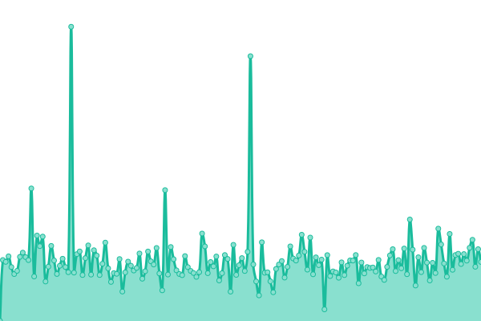
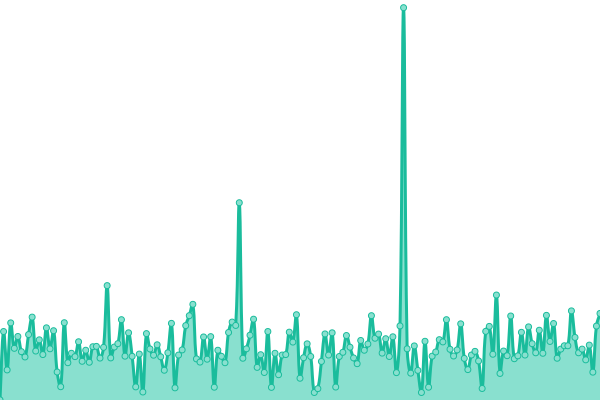

# [📈 Live Status](https://status.greep.gq): <!--live status--> **🟩 All systems operational**

This repository contains the open-source uptime monitor and status page for [Matthieu - Greep](greep.gq), powered by [Upptime](https://github.com/upptime/upptime).

With [Upptime](https://upptime.js.org), you can get your own unlimited and free uptime monitor and status page, powered entirely by a GitHub repository. We use [Issues](https://github.com/GreepTheSheep/upptime/issues) as incident reports, [Actions](https://github.com/GreepTheSheep/upptime/actions) as uptime monitors, and [Pages](https://status.greep.gq) for the status page.

<!--start: status pages-->
<!-- This summary is generated by Upptime (https://github.com/upptime/upptime) -->
<!-- Do not edit this manually, your changes will be overwritten -->
<!-- prettier-ignore -->
| URL | Status | History | Response Time | Uptime |
| --- | ------ | ------- | ------------- | ------ |
|  [Greep website](https://www.greep.gq) | 🟩 Up | [greep-website.yml](https://github.com/GreepTheSheep/upptime/commits/HEAD/history/greep-website.yml) | 

 773ms
     
 | 

<a href="https://status.greep.gq/history/greep-website">99.42%</a>
    

|  Discord Bot - Trackmania.io#5624 | 🟩 Up | [discord-bot-trackmania-io-5624.yml](https://github.com/GreepTheSheep/upptime/commits/HEAD/history/discord-bot-trackmania-io-5624.yml) | 

 237ms
     
 | 

<a href="https://status.greep.gq/history/discord-bot-trackmania-io-5624">100.00%</a>
    

|  [Node-Trackmania.io Docs](https://tmio.greep.gq) | 🟩 Up | [node-trackmania-io-docs.yml](https://github.com/GreepTheSheep/upptime/commits/HEAD/history/node-trackmania-io-docs.yml) | 

 342ms
     
 | 

<a href="https://status.greep.gq/history/node-trackmania-io-docs">99.43%</a>
    

|  [Frames In Order - Tangled](https://tangledframesapi.greep.gq/user) | 🟩 Up | [frames-in-order-tangled.yml](https://github.com/GreepTheSheep/upptime/commits/HEAD/history/frames-in-order-tangled.yml) | 

 697ms
     
 | 

<a href="https://status.greep.gq/history/frames-in-order-tangled">99.43%</a>
    

<!--end: status pages-->

[**Visit our status website →**](https://status.greep.gq)

## 📄 License

- Powered by: [Upptime](https://github.com/upptime/upptime)
- Code: [MIT](./LICENSE) © [Matthieu - Greep](greep.gq)
- Data in the `./history` directory: [Open Database License](https://opendatacommons.org/licenses/odbl/1-0/)
